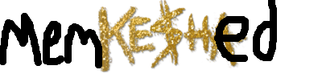

# aproxymate
**It's a proxy, mate**

#(and   )

**v. 0.2.0**

Aproxymate is an HTTP proxy written in python that handles 
HTTP GET requests and does basic temporary caching through its companion, Memkeshed.

For the most complete explanation of aproxymate and MemKeshed's abilities, protocols, and implementations (complete with code walkthroughs and instructions for early-stage demos), open the [aproxymate presentation](https://scottymjacobson.github.io/aproxymate/aproxymate_presentation.html) from this directory in your favorite JavaScript-enabled web browser.


Or, if you're slides-averse, I've converted the presentation into pure PDF-via-Markdown form.

## Usage:

###Launching MemKeshed:
Aproxymate will expect MemKeshed to have been launched the first time it checks for a cache result - to launch MemKeshed, go to the root directory and run:

```bash
python start_memkeshed.py memkeshed-port
```

Once MemKeshed has been launched, you are free to launch aproxymate with:

```bash
python start_aproxymate.py [-c cache-secs] aproxymate-port memkeshed-port 
```

Aproxymate will then be available to use as a proxy on port `aproxymate-port`, communicating with MemKeshed using `memkeshed-port`. Optional argument `cache-secs` specifies the number of seconds content should be cached for - default is 120 seconds. *(note - this is set as an aproxymate option because aproxymate specifies the cache time with each cache command - more details in the presentation)*


## Abilities:
###GET Request Forwarding:
aproxymate is able to interpret HTTP GET requests, forward
the original request (with all headers intact except encoding - see [Limitations](#limitations)) to the remote 
host, and return the response to that request to the original client. 

###GET Request Caching with MemKeshed:
During the proess outlined above, the URL requested is sent over the MemKeshed protocol (an application-layer protocol built on TCP), where it is checked against a key-value
store (cache), the keys of which are the URLs previously requested. If there is 
a hit in the cache, the proxy eschews requesting the document from the remote server 
and instead responds using the cached response. If there is no hit in the cache, aproxymate will respond back to MemKeshed, instructing it to cache the data from the remote server for `cache-time` amount of time.  


## Limitations<a name="limitations"></a>:
As of version 0.2.0, the following limitations are explicitly in place 
(others may be implicit):

- The destination server is notified not to use gzip or any other 
compression encoding schemes (the binary stream was getting garbled) and instead
use`identity`encoding 
- The proxy only accepts HTTP GET requests
- Upon shutdown, memkeshed's cache is emptied as it is stored in memory
and does not serialize
- Unable to intelligently handle 301 and other redirect / more complex response codes
- Because cache entries are serialized and then entered into the cache as strings, binary data such as jpgs don't serialize correctly within aproxymate and are thus unable to be cached (a possible fix would be to Base64 encode these and de-encode on the deserialization side)


